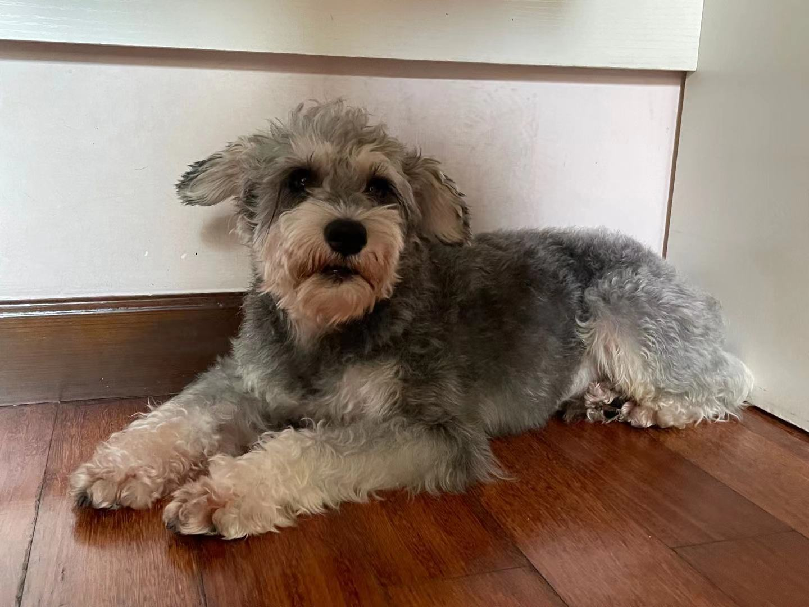

```{r setup, include=FALSE}
knitr::opts_chunk$set(echo = TRUE)
```

----- 

#### Introduction
Hi guys, I'm a sencond-year Master's student in the department of Epidemiology. My research interests are focused mainly on modifiable environment factors and genetic influences of cancer development. 

-----

#### Fun Facts
1. I have two dogs and a cat. They live with my family in China, haven't seen them for a while, actually almost a year. Miss them a lot TAT
<center>
{width=30%}
</center>

2. I love roller coasters! I basically only go to amusement parks for the roller coasters hahaha

3. I’ve had a year with only winter … I just got back from Brazil where it’s winter in June, July and August, however mow that Baltimore is starting to get cooler and preparing for winter，it feels like there is no summer for me this year


----
#### My Favorite BGM

[This](https://www.youtube.com/c/Chillhopdotcom) is my favorite background music when I'm reading or doing homework. The songs are super chill and relaxing, but still have great grooves!

